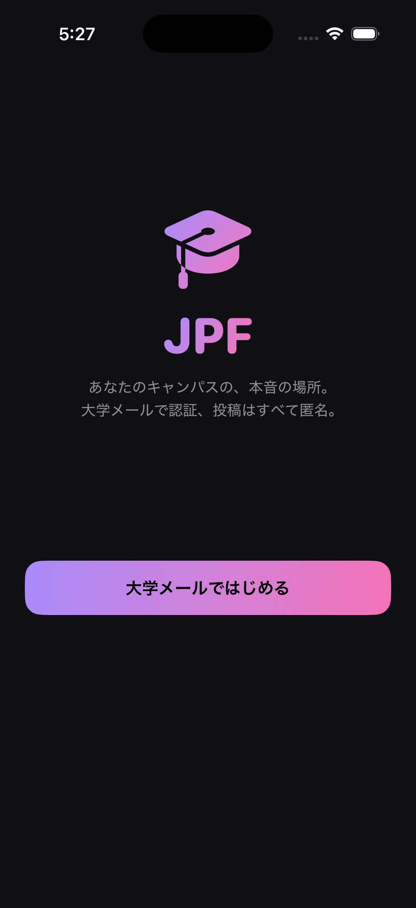
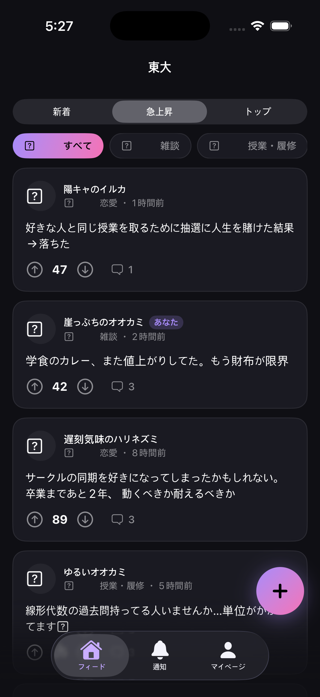

# JPF 🎓 — 日本の大学生のための匿名キャンパスSNS

Fizz / Sidechat スタイルの匿名キャンパスコミュニティ。大学メールアドレス（`.ac.jp`）で認証し、**投稿はすべて匿名** — 自分の大学の学生だけが見えるフィードで、本音で話せる場所。

An anonymous campus community app for Japanese university students, in the style of Fizz / Sidechat. Students verify with their university email (`.ac.jp`), then post anonymously to a feed visible only to their own campus.

| ようこそ | フィード |
| --- | --- |
|  |  |

## 特徴 / Features

- 🏫 **大学スコープ** — メールドメインで大学を判定（サブドメイン対応）。未登録の `*.ac.jp` は自動で大学を作成
- 🎭 **匿名エイリアス** — 投稿ごとにランダムな日本語エイリアス（例: 🦊 ねむいキツネ）。**同じスレッド内では同じ人は同じエイリアス**、投稿主には「主」バッジ
- 📈 **フィード** — 新着 / 急上昇（Reddit式 hot ランキング）/ トップ、チャンネル絞り込み、無限スクロール
- 💬 **ネストコメント**、⬆️⬇️ 投票、カルマ
- 📊 **アンケート**（2〜4択、投票後に結果バー表示）
- 📷 **画像投稿**（JPEG/PNG/WebP/HEIC、5MBまで）
- 🔔 **通知** — 自分の投稿へのコメント、コメントへの返信
- 🚨 **通報 & モデレーション** — 3件の通報で自動非表示、Web管理画面（`/admin`）で削除・BAN
- 📱 iOS（SwiftUI, iOS 17+）+ Next.js API バックエンド

## 構成 / Architecture

```
JPF/
├── backend/   Next.js 15 (App Router, TypeScript) + Prisma + SQLite
│              REST API (/api/v1/*) + モデレーション管理画面 (/admin)
└── ios/       SwiftUI アプリ (iOS 17+, 外部依存なし)
```

## セットアップ / Getting started

### 1. バックエンド

```bash
cd backend
npm install
cp .env.example .env
npm run setup      # DB作成 + シードデータ投入（23大学・9チャンネル・デモ投稿）
npm run dev        # http://localhost:3000
```

> 📧 開発モードではメールは送信されません。認証コードは **APIレスポンスの `devCode`** と **サーバーログ** に表示されます（アプリの画面にもヒントとして表示されます）。

### 2. iOSアプリ

```bash
open ios/JPF.xcodeproj
```

Xcode でスキーム `JPF` を選び、iOS シミュレータで実行。デフォルトで `http://localhost:3000` に接続します（マイページ → ⚙️ → サーバー設定で変更可能。実機の場合は Mac の IP アドレスを指定）。

**デモログイン**: `demo0@g.ecc.u-tokyo.ac.jp` などシード済みユーザーのメールを入力 → 画面に表示される開発用コードでログイン。

**モデレーター**: `mod@u-tokyo.ac.jp` でログインすると http://localhost:3000/admin の管理画面が使えます。

### コマンド一覧（backend）

| コマンド | 説明 |
| --- | --- |
| `npm run dev` | 開発サーバー起動 |
| `npm run setup` | DB スキーマ反映 + シード |
| `npm run db:seed` | シードのみ再実行（コンテンツはリセット） |
| `npm run typecheck` | TypeScript チェック |

## API リファレンス

Base URL: `/api/v1` — 認証は `Authorization: Bearer <JWT>`

| Method | Path | 説明 |
| --- | --- | --- |
| POST | `/auth/request-code` | 認証コード送信 `{email}` |
| POST | `/auth/verify` | コード検証 → JWT `{email, code}` |
| GET | `/me` | 自分のプロフィール（カルマ等） |
| GET | `/me/posts` | 自分の投稿一覧 |
| GET | `/schools` | 大学一覧 |
| GET | `/channels` | チャンネル一覧 |
| GET | `/feed?sort=new\|hot\|top&channel=&cursor=` | フィード（自分の大学のみ） |
| POST | `/posts` | 投稿作成 `{channelSlug, text, imageUrl?, poll?}` |
| GET / DELETE | `/posts/:id` | 詳細（コメント込み）/ 削除 |
| POST | `/posts/:id/vote` | 投票 `{value: -1\|0\|1}` |
| POST | `/posts/:id/comments` | コメント `{text, parentId?}` |
| POST | `/comments/:id/vote` | コメント投票 |
| POST | `/polls/:id/vote` | アンケート投票 `{optionId}` |
| POST | `/uploads` | 画像アップロード (multipart `file`) |
| GET | `/images/:name` | 画像取得 |
| POST | `/reports` | 通報 `{targetType, targetId, reason}` |
| GET | `/notifications` / POST `/notifications/read` | 通知 / 既読化 |
| GET | `/admin/reports` | 通報一覧（モデレーター） |
| POST | `/admin/reports/:id` | 対応 `{action: remove\|dismiss\|ban}` |

## 本番運用に向けて / Production TODO

- 📮 メール送信（Resend / SES）— 現状はdevモードでコードをレスポンスに含めるだけ
- 🐘 SQLite → PostgreSQL（Prisma の `provider` 切り替え）
- 🖼️ 画像を S3/R2 等のオブジェクトストレージへ
- 🔐 `JWT_SECRET` の変更、レート制限
- 💬 DM、プッシュ通知（v2）
